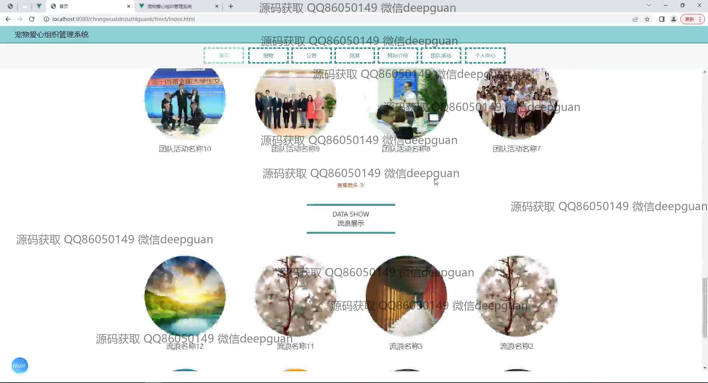
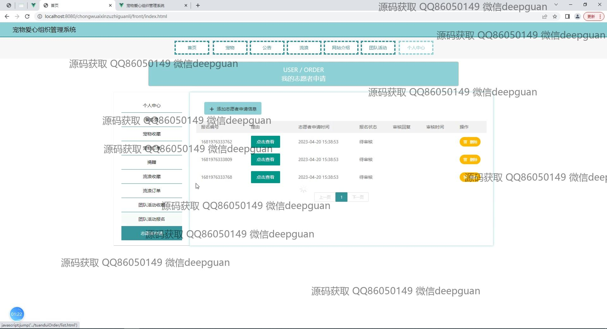
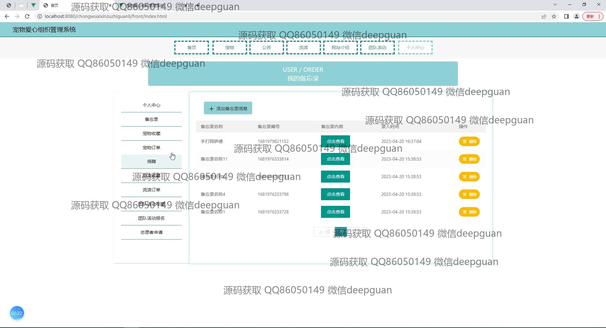
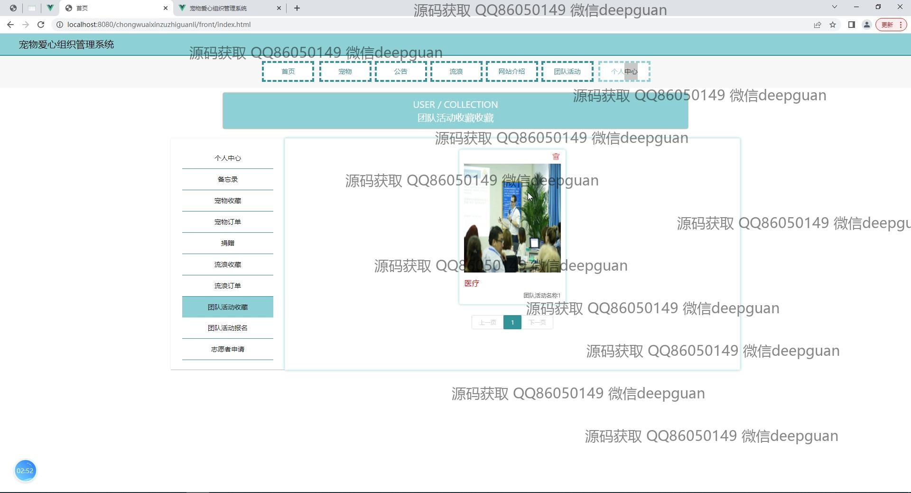
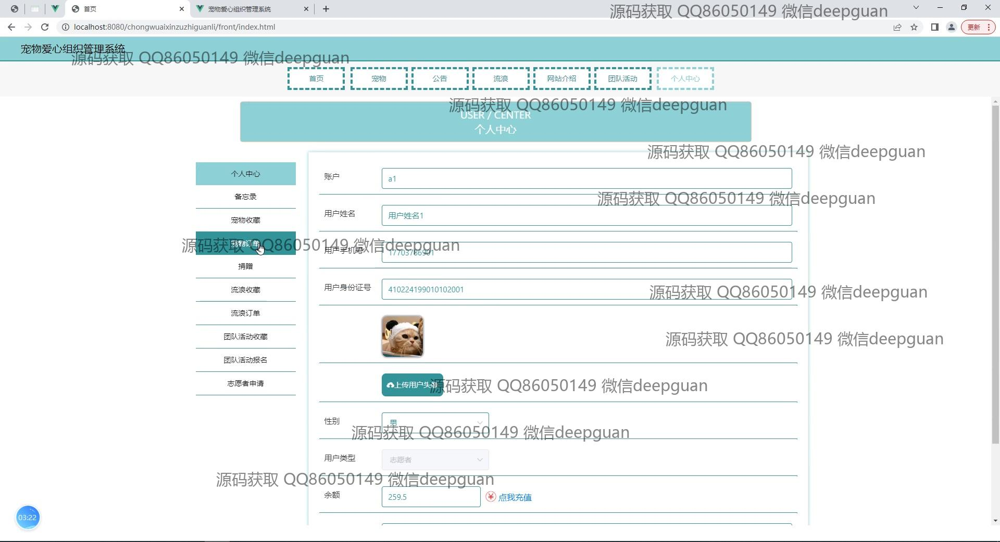
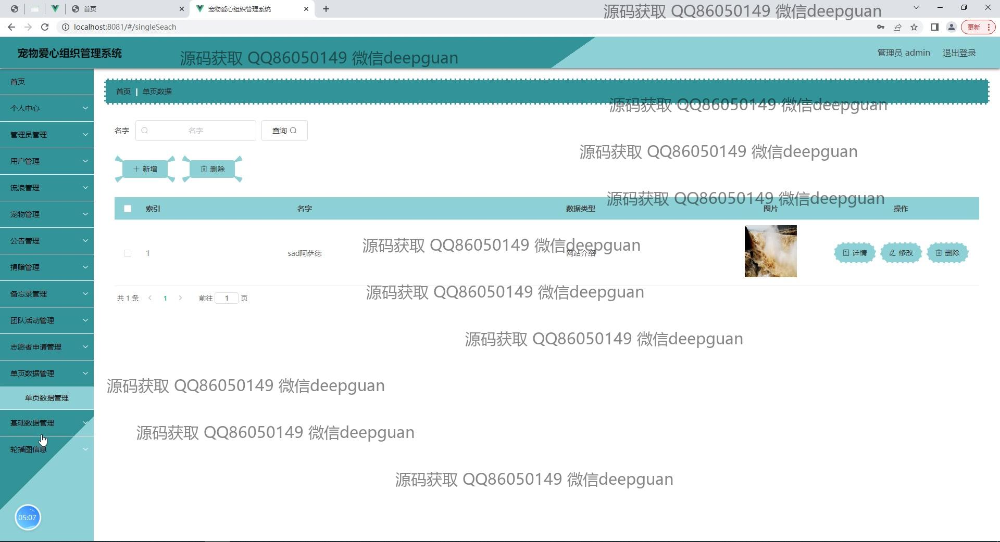

<h1 align="center">基于SpringBoot的宠物爱心组织管理系统</h1>

## 简介
宠物爱心组织管理系统：角色分为管理员、用户；包含首页、宠物、公告、领养、志愿者申请、团队活动、流浪宠物、捐赠管理等功能，提升宠物救助和活动组织的效率。    --计算机毕业设计源码；毕设源码；java毕业设计源码

## 联系方式

<h3 align="center">获取完整代码与数据库文件 + 微信：deepguan QQ: 86050149 QQ群: 783742310</h3>

<h3 align="center">可帮忙远程部署 包运行成功！提供远程部署、修改代码、设计文档指导、代码讲解等服务！</h3>

## 功能介绍（完整见运行截图）
管理员：基本功能包括登录、注册和退出，拥有查看和管理的权限。主要管理模块包括网站公告管理、宠物信息管理、流浪动物订单管理、志愿者申请管理、活动管理和评估管理。通过公告发布、活动组织和志愿者管理，管理员可以促进宠物领养和流浪宠物救助，活动报名和志愿者申请可以高效处理反馈。

用户：可以通过登录、注册来访问系统的各种功能。能够浏览宠物细节，通过确认领养功能进行领养宠物，查看流浪动物信息，申请成为志愿者或参与活动。个人中心提供账户信息查看和编辑，包含收藏、订单、捐赠记录等。

志愿者：通过申请流程加入爱心组织，通过“志愿者申请管理”模块跟踪申请进度和状态，能够报名参加各类爱心活动，通过参与活动来进行相应的评价与反馈管理。

访客：在主页上浏览各种活动公告和宠物展示信息，通过“网站介绍”了解组织背景，由于没有登录权限，无法进行领养或报名操作。

## 运行截图

本代码来源于网络,仅供学习参考使用!

